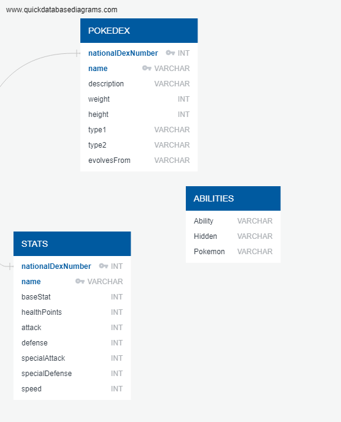

# Pokedex Database
## Project Summary

 Create a database of Pokemon characters with “biological” data, as well as competitive data (such as popular moves, held items, etc), in order to please both the casual enjoyer as well as the competitive player, and even to help those looking to break into the metagame in team building. This will be done by creating a set of tables with information on the relevant Pokemon.

## System Requirements
* Jupyter notebook 
* Python dictionaries
    - sqlalchemy
    - psycopg2
    - pandas
* Misc. files
	- db_pw (python file with database password)

## Resources
* 
<a href="https://github.com/akpatell/project_2_poke_decks.git ">GitHub Repository</a>

* Database: PostgreSQL/pgAdmin
* Datasets:
	- <a href="https://www.kaggle.com/datasets/giorgiocarbone/complete-competitive-pokmon-datasets-may-2022?select=df_items.csv">Complete Competitive Pokémon Database (May 2022) 08072022</a>
	- <a href="https://www.kaggle.com/datasets/rounakbanik/pokemon">The Complete Pokemon Dataset 2017</a>

## Group Members
* Kelly Brown
* Subodh Chintawar
* Gautam Iyer
* Leon Lee
* Ami Patel
* Aimee Vu
* William Tecchio

## General Tasks
* Extract
	- 2 CSV files (<a href="resources/pokemon.csv">pokemon.csv</a> and <a href="resources/df_pokemon.csv">df_pokemon.csv</a>) were extracted into Jupyter
	
    - 1 CSV file (<a href="resources/bridge_pokemon_ability_MAY_HAS.csv">bridge_pokemon_ability_MAY_HAS.csv</a>) was imported directly into postgres.
    
* Transform 
	- Data Cleaning and Normalization
        
	- Build relationship within different datasets
    - Primary keys used to build relationships were nationalDexNumber and name
      
	- Define and build key statistics 
      
	- See Tables section below
* Load
	- PostgreSQL

## Tables

Tables created are: 

1. Table 1 - Pokedex (Biological Information)
2. Table 2 - Stats
3. Table 3 - Abilities

## Table ERD

This image was generated using <a href="https://www.quickdatabasediagrams.com/">QuickDB</a>.

The code that was used to generate this table schema can be found <a href="QuickDB ERD Code.txt">here</a>, while the generated sql query can be found <a href="pokedex.sql">here</a>.

## Transformation Process
### Table 1: Pokedex

For this table, the files pokemon.csv and df_pokemon.csv were used. To start off, the data is extracted from pokemon.csv into a Pandas dataframe. Because the original datasource had extra columns from what was needed for the database, only the necessary columns were pulled.

After analyzing the data, the following issues were identified:

* Null values in weight column
* Null values in height column
* Null values in type2 column

The original database schema sets up the table to not allow null values, but upon further discussion, it was determined that for future (hypothetical) analysis, null values were necessary for height and weight. These were left as null rather than 0.0 because 0.0 is still a value that would provide inaccurate results for any analysis.

The last column, evolvesFrom, derives from the second CSV file, df_pokemon. Because of this, the column is initially left blank during the dataframe setup. It was later populated using the python loc function to match the name from the dataframe to the name in the second CSV file.

This process resulted in a key error, which was resolved using the try-except statement. In addition, to remove any extra columns, the national dex number was set as the index.

### Table 2: Stats

This table utilizes df_pokemon.csv. Like the first CSV file, this data source also contained more columns than were necessary for the table.

After the data is loaded into a dataframe, the issues that were identified included:

* Base Stat are float values
* Health Points are float values
* Attack are float values
* Defense are float values
* Special Attack are float values
* Special Defense are float values
* Speed are float values
* Extra rows that are not found in Table 1
* Rows with null values

After reviewing the CSV file in Excel, the only rows that contained null values were rows that had no data altogether so the final decision was to exclude them altogether.

Because Table 2 has a dependency on Table 1 through the foreign key of national dex number, extra rows that were not found in Table 1 caused the data to fail. After analyzing the data through Excel, the final solution was to select the rows that had a dex number of 801 or lower. This dex number is the last number in Table 1, so using this condition guaranteed that the rows we load into Table 2 exist in Table 1.

The columns with float values posed an issue because the table schema sets up the columns to only allow integers. Rather than changing the table schema, the columns were converted to an integer using the astype function in Python.

### Table 3: Abilities

The last table utilizes the file bridge_pokemon_ability_MAY_HAS.csv. To provide a different process of ETL, this file is imported directly into Postgres via the built-in import function.

From there, three queries are ran to do the following:

1. List all Pokemon and their respective abilities using a join on Pokedex and Abilities tables

2. List of Pokemon name and number of abilities they have using the join on Pokedex and Abilities tables and grouped them by name

3. List of pokemon ablities and number of pokemon using it using the join on Pokedex and Abilities tables and grouped them by ability

The queries can be found <a href="PokeDexQueries.sql">here</a>.

